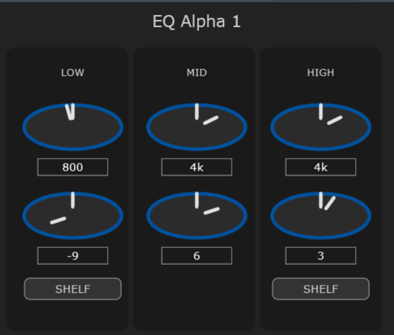

# EQ Alpha 1 - API 550A-Inspired VST3 Equalizer Plugin

**EQ Alpha 1** is a VST3 equalizer plugin inspired by the legendary API 550A, designed for electronic music producers seeking musical tone shaping with a modern, user-friendly interface. Built using **JUCE 8.0.9** and the **Steinberg VST3 SDK**, this plugin seeks to emulate the proportional Q, stepped controls, and warm saturation of the iconic API 550A, perfect for electronic music production, mixing, and mastering.  It is a concept based plugin not an actual emulation of the API 550A. It is not a replacement for the API 550 A but it takes some of the same design principles and applies them in a JUCE packaged solution to apply those design ideas.

Developed by **William Ashley**, a hobbyist electronic music artist, and new plugin developer. This project aims to bring a very basic eq as I attempt to
learn more about the historic types of eqs and other plugins and create concepts as I learn more about plugin design. Visit my [Official Homepage](https://12264447666william.wixsite.com/williamashley) or [Hopp.co page](https://www.hopp.bio/william-ashley) to discover new music and learn more about my work.

## Features

- **3-Band EQ**: Low, Mid, and High bands with stepped frequency and gain controls, mirroring the API 550A’s discrete settings.
- **Proportional Q**: Automatically adjusts filter bandwidth based on gain for musical, intuitive sound shaping.
- **Shelf/Peak Switching**: Toggle Low and High bands between peak (bell) and shelf modes for versatile EQ curves.
- **2520 Op-Amp Saturation**: Copies the idea of the API 2520’s warm, musical distortion using `juce::dsp::WaveShaper`. its nota  2520 but it is an easy way of applying a JUCE concept to it.
- **Modern UI**: Sleek, rotary knob-based interface with clear labels, designed for electronic music producers. Its a little lacking but I am not really
- focusing on GUI deisgn at the moment just usability of the audio processing concepts.
 

## Screenshots

*EQ Alpha 1’s intuitive interface with rotary knobs and shelf switches.*

Install:Windows: Copy EQAlpha1.vst3 to C:\Program Files\Common Files\VST3\.

Load in DAW: Open your DAW (e.g., Ableton Live, FL Studio, Reaper) and scan for VST3 plugins to load EQ Alpha 1. Only Tested in FL Studio 2025

UsageAdd EQ Alpha 1 to a track in your DAW.
Use the  knobs to adjust Low Freq, Low Gain, Mid Freq, Mid Gain, High Freq, and High Gain. Currently in EQAlpha1 these are set at subbands, EQ Alpha 2intends 
full range frequency adjustment. 

Toggle Low Shelf and High Shelf buttons to switch between peak and shelf modes.
Experiment with gain settings to leverage the proportional Q for gentle or surgical EQ adjustments.
Push the signal for subtle saturation inspired by the API 2520 op-amp.

Check out my YouTube channel for tutorials on using EQ Alpha 1 in electronic music production.Building from SourcePrerequisites
JUCE 8.0.9: Download from juce.com or clone the repository github.com/juce-framework/JUCE.

Steinberg VST3 SDK: Obtain from steinberg.net and place in C:\SDKs\VST3 SDK (Windows) or equivalent.

Visual Studio 2022 Community: Install with C++ support for Windows builds.
CMake 3.22+: For project configuration. Download from cmake.org.

Build in Visual Studio:Open the generated solution in Visual Studio 2022.
Build the Debug or Release configuration for x64.
Find the VST3 plugin in Builds\VisualStudio2022\x64\Debug\VST3\EQAlpha1.vst3.

LicensingEQ Alpha 1 is licensed under the GNU General Public License v3.0 (GPLv3). See LICENSE for details.
JUCE 8.0.9JUCE is an open-source C++ framework licensed under GPLv3 (or a commercial license for proprietary use). 
This project uses the GPLv3 version. For more information, visit juce.com or see JUCE’s GitHub.

Steinberg VST3 SDKThe VST3 SDK is licensed under the Steinberg VST3 license or GPLv3.
This project uses the GPLv3 option.
VST® is a registered trademark of Steinberg Media Technologies GmbH. 
For details, see steinberg.net or VST3 C API GitHub.

ContributingContributions are welcome! Please:Fork the repository.
Create a feature branch (git checkout -b feature/YourFeature).
Commit changes (git commit -m "Add YourFeature").
Push to the branch (git push origin feature/YourFeature).
Open a Pull Request.

For bug reports or feature requests, open an Issue.About the DeveloperWilliam Ashley is an electronic music artist and plugin developer passionate about creating tools for music production. Explore my music and projects:Official Website: 12264447666william.wixsite.com/williamashley
Hopp.co: www.hopp.bio/william-ashley
YouTube: youtube.com/@WilliamAshleyOnline
Medium: medium.com/@12264447666.williamashley
GitHub: github.com/WilliamAshley2019

Follow my journey in electronic music production and plugin development!
Acknowledgments
EQ Inspired by the API 550A equalizer, designed by Saul Walker. A piece of audio engineering history.
Built with JUCE 8.0.9 and the Steinberg VST3 SDK.
Thanks to the open-source community for their contributions to JUCE and VST3.

You can donate at https://buymeacoffee.com/williamashley if you would like to.
